# Rime 徐码输入方案

[发布地址](https://github.com/Ace-Who/rime-xuma) ·
[项目主页](https://ace-who.github.io/rime-xuma/) ·
[更新日志](CHANGELOG.md) ·
[徐码文档](https://www.xumax.top) ·
[徐码五二顶](misc/五二顶)

[Rime 输入法软件](https://rime.im/)

[TOC]

## 前言

徐码简繁通打输入法，又名爾雅简繁通打输入法。这是一个初学者为了让自己用最舒服的
姿势学会徐码和日常打字而设计的用于 Rime 平台的方案。

配置和使用中可能遇到的大多数问题，答案都在本说明中，请仔细查阅。如果找不到答案
，欢迎提交 issue 反馈。

特色功能「三重注解」：

- 字根拆分 + 编码 + 拼音。
- 支持词组拆分（按照官方词组编码规则）。
- 大码大写、全简合一。
- 标点和[符号][`symbols.yaml`]也显示徐码编码。

[`symbols.yaml`]: https://github.com/rime/rime-prelude/blob/master/symbols.yaml

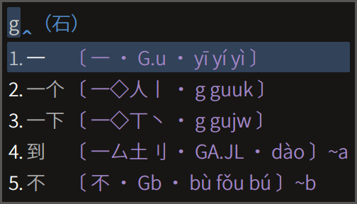

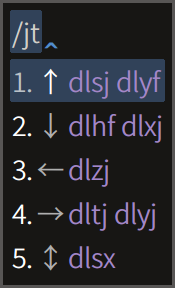
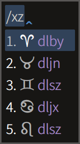

方案自带说明：

快捷键演示：

## 配置说明（已经很短的）

1. 下载[最新发布][]，将 schema 目录下的「所有」文件（注1）放到 rime 用户目录（
   易错题：什么是 [用户目录][]）。
1. 在输入法设定中添加方案「徐码·QS」或（和）「徐码·QS·一型」（注2），对顶功
   有兴趣的可以尝试更高效的「[徐码五二](misc/五二顶)」。（注3）

[最新发布]: https://github.com/Ace-Who/rime-xuma/releases/latest
[用户目录]: https://github.com/rime/home/wiki/UserData

注 1：`xuma.extended.dict.yaml` 用于用户添加个人词库，内含用法说明，更新时请备
份并保留该文件，以免丢失个人词库。  
注 2：「一型」的特点是水平排列候选、内嵌输入码、每页三个候选、禁用逐键提示。简
言之，更简洁，更适合老手。  
注 3：列表中的其他方案均为伪方案或辅助方案，不可直接使用。  
注 4：iRime 的配置方法或许有些不同，请另外寻找说明。我自己没有成功部署，原因未
知。

## 功能介绍

重点总结：

- 三重注解、双重反查，为徐码初学者（我）扫除障碍。
- 固定词序和自造词动态调序兼得，两全其美。
- 还可一键屏蔽词组，同时满足单字派和词组派。
- 全码后置：出简亦出全，但是将有简码的单字在全码重码时放到后面，实现避重。

可即时开关或变更的功能：

- 【三重注解】：参考演示。默认开启。
- 【全拼反查】【五笔画反查】【双重反查】。
- 【屏蔽词组】：默认关闭。
- 【字集切换】：GB2312、GBK（默认）、BIG5、UTF-8（全字集）。
- 【显示时钟】：默认关闭。
- 【繁体简化】：即繁入简出。默认关闭。
- 【简入繁出】：默认关闭。
- 【全码后置】：简码单字排序靠前，全码重码时降低排序，让位于无简码字词。默认开
启。

固定特性：

- 内置词顺序固定：固态词典中的字词，永远置顶且顺序固定。
- 自造词自动调序：用户词典中的词组，最近常用者排序靠前。
- 简码词组次三选：所有一级简码词组和二级简码词组保证排在候选的第二位和第三位。
- 重复历史上屏：输入 `dl`。
- 支持手动造词：只需以单引号 `'` 或反撇号 `` ` `` 分隔输入串。
  如：欲造「手动造词」，输入 `rs'ea'poz'zb` 后依次选字即可。
  如果已存在词组「手动」和「造词」，也可输入 `rsea'pozb`。
  （目前方案将 `'` 绑定为上屏第三候选了，只能用 `` ` ``。）
- 支持自动造词：（现已不启用，启用方法是将
  `xuma_qshare.schema:/translator/encode_commit_history` 的值改为 `true`。）
  连续上屏的字词中，五字以内的段落，自动编码为徐码（四码）。输入该编码再次上屏
  ，便收入用户词典（特征是后面不再出现太极图章「☯」，且纳入逐键提示的范围）。
  参考下方图示。

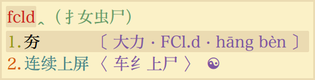

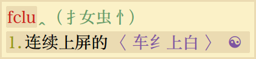

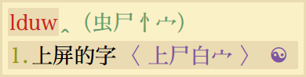

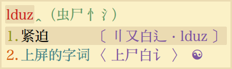

上屏成词之后：

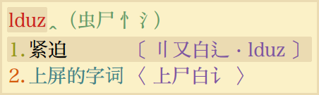

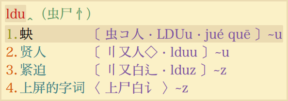

## 使用说明

自带说明请善加利用：

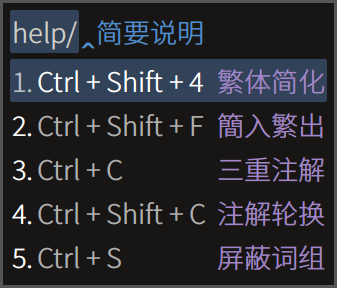
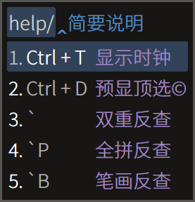

功能开关快捷键：

- <kbd>Ctrl</kbd> + <kbd>Shift</kbd> + <kbd>4</kbd>：繁体简化
- <kbd>Ctrl</kbd> + <kbd>Shift</kbd> + <kbd>F</kbd>：简入繁出
- <kbd>Ctrl</kbd> + <kbd>C</kbd>：三重注解，仅输入状态可用。
- <kbd>Ctrl</kbd> + <kbd>Shift</kbd> + <kbd>C</kbd>：
  「〇→一重→二重→三重」注解模式轮换，仅输入状态可用。
- <kbd>Ctrl</kbd> + <kbd>S</kbd>：屏蔽词组，仅输入状态可用。
- <kbd>Ctrl</kbd> + <kbd>T</kbd>：显示时钟，仅输入状态可用。
- <kbd>Ctrl</kbd> + <kbd>D</kbd>：
  预显候选，即显示输入码分段所对应的两个候选，顶功专用，仅输入状态可用。
- <kbd>F4</kbd> / <kbd>Ctrl</kbd> + <kbd>\`</kbd>：
  方案选单，可控制以上所有开关和字符集选择、全码后置。
  这是 Rime 内置的快捷键，更多内置功能请参考 [Rime 使用说明][RimeUserGuide]。

[RimeUserGuide]: https://github.com/rime/home/wiki/UserGuide

通过 `F4` 选单切换「漢字／汉字」，可记忆简化字开关，通过快捷键切换则不记忆。

功能引导串：

- `dl`：调出历史上屏。
- `` ` ``：双重反查（全拼 + 五笔画）。
- `` `P``：全拼反查。
- `` `B``：五笔画反查（横h 竖s 撇p 捺/点n 折z）。
- `env/`：获取系统环境变量，后跟变量名。
- `help/`：查看本方案简要使用说明。

技巧提示：

- 使用拼音反查时，默认排序以繁体优先，可通过切换「繁体简化」来改变，同时「简入
繁出」应当是关闭的。

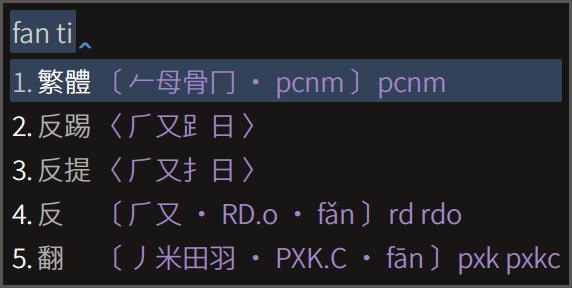
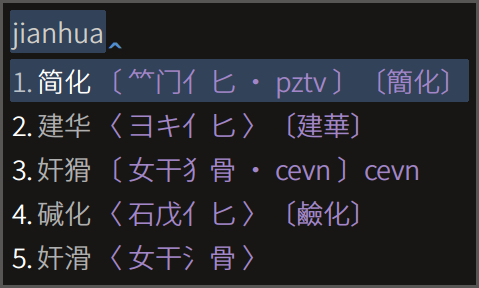

更多细节演示：

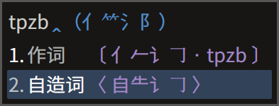

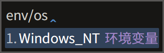

## 数据来源

原始码表由徐码作者徐国银先生提供，含九万多字和约八万简繁词组，经过修改，还在持
续修订维护中。

字根拆分原始数据由 QQ 徐码输入法官方群（218210590）小鸮（1360057135）提供。  
拼音数据来自 [Mozillazg 整理的汉典数据](https://github.com/mozillazg/pinyin-data)。

## 关于简码

### 单字简码

官方码表的简码设置有优化空间，我参考汉语字频统计资料作了修改。徐码的简码设置原
则之一，是简码不占用全码汉字的编码，我基本遵循这个原则，字频表收录的 14000 余字
中，一字若无简码，则其全码不设置为其他字的简码。

举一个修改的例子：「没」「为」二字同为高频字且频率相近，「为」字设置了一级简码
`z`，而「没」字没有简码，其全码 `zqs` 指法很难，但是二简 `zq` 上又有高频字「学
」。所以最好的做法是将 `z` 让给「没」字，将中频字「沙」的二简 `zc` 让给「为」，
将低频字「娑」字的三简 `zcp` 让给「沙」。

另一例：「然」「得」二字同为高频字且频率相近，分别设置了简码 `sj` 和 `s`，改为
`s` 和 `sk` 则可空余出 `sj`，来分配给次高频字「周」。

以下仅列出一级简码单字的修改：

| 编码 | 修改前 | 修改前 | 修改后 | 修改后 |
| ---- | ------ | ------ | ------ | ------ |
| `a` | 出 `a aau`  | 能 `asv`     | 出 `aa aau`  | 能 `a asv`  |
| `h` | 在 `h hkjv` | 有 `hsv`     | 在 `hk hkjv` | 有 `h hsv`  |
| `m` | 同 `m mgov` | 见 `mve`     | 同 `mg mgov` | 见 `m mve`  |
| `n` | 国 `n neww` | 当 `nbu`     | 国 `ne neww` | 当 `n nbu`  |
| `z` | 为 `z zcl`  | 没 `zqs`     | 为 `zc zcl`  | 没 `z zqs`  |
| `s` | 得 `s skir` | 然 `sj sjsh` | 得 `sk skir` | 然 `s sjsh` |

单字简码不设多重，目前有两个例外：`o` 的三选给「啊」字，`t` 的三选给「们」字。

随着本方案的更新，简码也可能发生新的修改，请知悉。

### 词组简码

简词设置两重，固定为次选和三选。对于二简词组，第一重的取码为前两字的首码，第二
重的取码为其全码的前两码。三字以上的词组，两种取码的结果相同。这些与官方码表相
同，具体选词已经过全面修改。

### 二简置换码

为了效率最大化，现已将大多数字根编码位设置为较高频字的二简，从而使二码字总体频
率提高 5.1 个百分点。坏处是二简字与成字字根重码，导致打该字根需要选重（在没有屏
蔽词组的情况下，是第四候选），如「`bg` 司 艮」「 `qs` 解 殳」「`tp` 作 片」等。
为此引入「置换码」来系统性地解决这个问题。举例说明，「司」原来的简码是 `bgo`，
现将它与「艮」的编码 `bg` 置换，即从「`bg` 艮」「`bgo` 司」变成「`bg` 司 艮」「
`bgo` 艮」，两字和以前一样无需选重。称 `bgo` 为「艮」的「字根扩展码」。又如，「
殳」的扩展码是「解」的全码 `qsdp`，「片」的扩展码是「作」的全码 `tpl` 。置换码
以规则的方式为成字字根设置特殊码，是一种「规则的不规则」，既解决了重码选字问题
，又无须强记，因为对应的二简字本身就是编码提示。

## 常见问题

**部署失败——主要方案未能识别**  
目前已知一种情况：`v0.6.8` 及之前一段时间的版本的配置，强制引用基础配置文件
[`key_bindings.yaml`][] 文件，而这些文件在有的 Rime 发行版中或没有预置，或被删
除，或需要通过软件选项恢复（如同文）。其他情况：尝试重装 Rime 程序。尝试
[旧版发布][]。

[`key_bindings.yaml`]: https://github.com/rime/rime-prelude/blob/master/key_bindings.yaml
[旧版发布]: https://github.com/Ace-Who/rime-xuma/releases

**配置之后打不出汉字怎么办？**  
答：尝试一次「重新部署」。重装 Rime 程序。尝试[旧版发布][]。

**为什么有些候选词显示为方块或空白？**  
答：你使用的字体没有收取这个字。

**为什么不显示三重注解，无法屏蔽词组、显示时钟、后置全码单字？**  
答：这几个功能是通过 lua 插件实现的，而一些 Rime 发行版不支持 lua 插件，有条件
可尝试更新。另参考 librime-lua 作者的[解释][lua's popularity]。可向发行版开发者
建议以推动实现对 librime-lua 的支持。同文的正式版不支持，测试版已支持。

[lua's popularity]: https://github.com/hchunhui/librime-lua/issues/22

**为什么安卓同文输入法不能反查？**  
答：同文输入法官方版可能没有打包预置方案，而反查功能依赖[朙月拼音][]和
[五筆畫][]方案。可自行下载并重新部署。

[朙月拼音]: https://github.com/rime/rime-luna-pinyin
[五筆畫]: https://github.com/rime/rime-stroke

**为什么 `Ctrl+Shift+4` 等快捷键不起作用？**  
答：部分快捷键不是直接在方案中定义，而是引用基础配置文件 [`default.yaml`][] 或
[`key_bindings.yaml`][] 的定义。而这些文件在有的 Rime 发行版中或没有预置，或被
删除，或需要通过软件选项恢复（如同文）。

[`default.yaml`]: https://github.com/rime/rime-prelude/blob/master/default.yaml
[`key_bindings.yaml`]: https://github.com/rime/rime-prelude/blob/master/key_bindings.yaml

**为什么输入 `/jt`、`/fh` 等不能打出符号？**  
答：由斜杠「/」引导的符号定义在基础配置文件 [`symbols.yaml`][] 中。有的 Rime
发行版，没有打包这个文件或被删除，可自行下载或使用软件选项来恢复文件（如同文）
，并重新部署。

**如何删除用户词？**  
答：删除特定用户词：输入该词编码，移动光标选中该词，敲删词键 <kbd>Ctrl</kbd> +
<kbd>Delete</kbd> 或 <kbd>Shift</kbd> + <kbd>Delete</kbd> （Mac OS 用
<kbd>Shift</kbd> + <kbd>Fn</kbd> + <kbd>Delete</kbd>），默认还绑定了
<kbd>Ctrl</kbd> + <kbd>K</kbd>。删除整个用户词典：先退出输入法程序或算法服务，
然后删除用户目录下的 `xuma.userdb` 目录，再启动输入法。

**为什么码表更新后，有的字用新的编码打不出来？**  
答：需要「重新部署」。

**为什么码表更新后，有的字还能用旧编码打出来？**  
答：需要「重新部署」。如果以前用旧编码打过这个字，那么它还被记录在用户词典中，
即是一个用户词，可用删除用户词的方法删除之。

**我可以修改方案名称吗？**  
答：方案名称由配置文件 `<schema_id>.schema.yaml` 的 `schema/name` 节点定义，可
自由修改，但除非懂得定制方法，不要修改 `schema_id` 或任何文件的名称或路径。

**`lua/ace/data/xuma_spelling.reverse.bin` 文件是什么？**  
答：这是 v0.4 中预编译的三重注解词典，从 v0.5 起不再使用，可以删除。

**如何记忆字根？**  
答：这个问题本来与本项目无关，但是我碰巧解决过，可以看[这里][Anki]。为方便初学
者，解决方案也打包在本项目中了。这是一个利用碎片时间即可在累计三小时内识记字根
的办法，如果你对于学习徐码的疑虑主要在于字根记忆的难度，那么不妨先花一个月时间
，每天三五分钟，在不知不觉中初步解决这个问题，再决定是否正式开始学习。

[Anki]: https://github.com/Ace-Who/rime-xuma/tree/master/misc/anki
