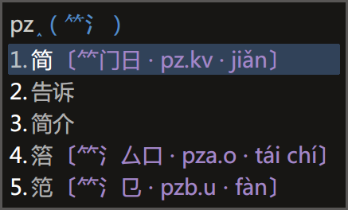
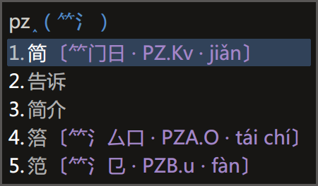

# Rime 徐码三重注解方案与补丁

[发布地址](https://github.com/Ace-Who/rime-xuma-spelling) ·
[项目主页](https://ace-who.github.io/rime-xuma-spelling/) ·
[徐码文档](https://www.xumax.top) ·
[Rime 输入法引擎 | 中州韻 | 小狼毫 | 鼠须管](https://rime.im/)

## 功能

多种实用功能，尤其适合「徐码简繁通打输入法／爾雅输入法」初学者（我）。

- <kbd>Ctrl</kbd> + <kbd>Shift</kbd> + <kbd>R</kbd>：三重注解（字根拆分提示 + 编
码提示 + 拼音提示）
- <kbd>Ctrl</kbd> + <kbd>Shift</kbd> + <kbd>F</kbd>：简入繁出
- 引导符「\`」：双重反查（全拼 + 五笔画）
- 引导符「\`P」：全拼反查
- 引导符「\`B」：五笔画反查（横h 竖s 撇p 捺/点n 折z）
- <kbd>Ctrl</kbd> + <kbd>C</kbd>：三重注解的另一个快捷键，仅在选字界面有效。
- <kbd>F4</kbd> / <kbd>Ctrl</kbd> + <kbd>\` </kbd> 选单：可控制字符集选择（默认
GBK）、繁体简化（繁入简出，默认开启）、简入繁出、三重注解（码／根）等。

还有其它贴心特性，省略介绍。

## 说明

可使用完整方案，文件在 schema 目录下。

也可使用补丁，文件在 patch 目录下。需要自备基础方案，包括 xuma.schema.yaml 文件
和词典文件。补丁仅包含三重注解功能。

注意：完整方案与补丁并非配套，只选一个来用，opencc 文件为共用。补丁仅用于你既有
的 xuma.schema.yaml。

1. 将方案或补丁文件放到 rime 用户目录（补丁与 xuma.schema.yaml 并列），
2. 将 opencc 内的文件放到「程序目录/data/opencc」目录。

补丁默认使用 `xuma_spelling_qmod.json`，可修改 xuma.custom.yaml 以使用
`xuma_spelling_qmod_xumaCase.json`，效果是「**大码大写**」。

或用 `xuma_spelling_qmod_2in1code.json`，效果是「**简全合一**」。

还有 `xuma_spelling_qmod_xumaCase_2in1code`，「**两者兼得**」。完整方案默认使用
此版本。

## 提示

结合反查功能使用效果更佳，三重注解滤镜已经配置为对 `tag` 为 `reverse_lookup` 的
相关组件生效。（完整方案已包含双重反查功能）

## 其它

字根拆分提示数据由 QQ 徐码输入法官方群（218210590）小鸮（1360057135）提供。  
拼音数据来自 [Mozillazg 整理的汉典数据](https://github.com/mozillazg/pinyin-data)。
