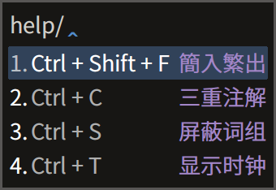
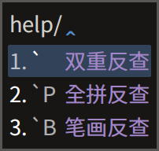

# Rime 徐码输入方案

[发布地址](https://github.com/Ace-Who/rime-xuma) ·
[项目主页](https://ace-who.github.io/rime-xuma/) ·
[徐码文档](https://www.xumax.top) ·
[徐码五二顶](misc/五二顶)

[Rime 输入法软件](https://rime.im/)

[TOC]

徐码简繁通打输入法，又名爾雅简繁通打输入法。这是一个初学者为了让自己用最舒服的
姿势学会徐码和日常打字而设计的用于 Rime 平台的方案。

请仔细阅读本说明。配置和使用中 99% 的问题，答案都在这里。找不到答案的问题也欢迎
提交 issue。

特色功能「三重注解」：

- 字根拆分 + 编码 + 拼音。
- 支持词组拆分（按照官方词组编码规则）。
- 大码大写、全简合一。
- 标点和[符号](
  https://github.com/rime/rime-prelude/blob/master/symbols.yaml
  )也显示徐码编码。

方案自带说明：

快捷键演示：

## 配置说明（已经很短的）

1. 下载[最新发布包](https://github.com/Ace-Who/rime-xuma/releases/latest)，将
   schema 目录下的「所有」文件（`xuma.extended.dict.yaml` 除外，见注1）放到 rime
   用户目录（易错题：什么是[用户目录](
     https://github.com/rime/home/wiki/UserData)）。
2. 在输入法设定中添加方案「徐码·QS」或（和）「徐码·QS·一型」（注2），对顶功
   有兴趣的可以尝试更高效的「[徐码五二](misc/五二顶)」。（注3）

注 1：`xuma.extended.dict.yaml` 用于用户添加个人词库，内含用法说明，更新时请备
份并保留该文件，以免丢失个人词库。  
注 2：「一型」的特点是水平排列候选、内嵌输入码、每页三个候选、禁用逐键提示。  
注 3：列表中的其他方案均为伪方案，用于功能实现，不可直接使用。
注 4：iRime 由于 iOS 系统限制，安装方法有些不同，请另外寻找说明。

## 功能

重点总结：

- 三重注解、双重反查，为徐码初学者（我）扫除障碍。
- 固定词序和自造词动态调序兼得，两全其美。
- 还可一键屏蔽词组，同时满足单字派和词组派。
- 全码后置：出简亦出全，但是将有简码的单字在全码重码时放到后面，实现避重。

可即时开关或变更的功能：

- 【三重注解】：参考演示。默认开启。
- 【全拼反查】【五笔画反查】【双重反查】。
- 【屏蔽词组】：默认关闭。
- 【字集切换】：GB2312、GBK（默认）、BIG5、UTF-8（全字集）。
- 【显示时钟】：默认关闭。
- 【繁体简化】：即繁入简出。默认关闭。
- 【简入繁出】：默认关闭。
- 【全码后置】：由于简码单字总是排在首位，所以如果全码有重码，不妨将它降低排序
，让位于无简码字词。默认开启。

固定特性：

- 内置词顺序固定：固态词典中的字词，永远置顶且顺序固定。
- 自造词自动调序：用户词典中的词组，最近常用者排序靠前。
- 简码词组次三选：所有一级简码词组和二级简码词组保证排在候选的第二位和第三位。
- 重复历史上屏：输入 `dl`。
- 支持手动造词：只需以单引号「'」分隔输入串。如：欲造「手动造词」，输入
`rs'ea'poz'zb` 后依次选字即可。如果已存在词组「手动」和「造词」，也可输入
`rsea'pozb`。
- 支持自动造词：（现已不启用，若要启用，可自行将
`translator/encode_commit_history` 的值改为 `true`。）连续上屏的字词，五字以内
的段落，自动编码为徐码（四码）。输入该编码再次上屏，便收入用户词典（特征是后面
不再出现太极图章「☯」，且纳入逐键提示的范围）。参考下方图示。

上屏成词之后：

## 使用说明

自带说明请善加利用：

功能开关快捷键：

- <kbd>Ctrl</kbd> + <kbd>Shift</kbd> + <kbd>4</kbd>：繁体简化
- <kbd>Ctrl</kbd> + <kbd>Shift</kbd> + <kbd>F</kbd>：简入繁出
- <kbd>Ctrl</kbd> + <kbd>C</kbd>：三重注解，仅输入状态可用。
- <kbd>Ctrl</kbd> + <kbd>S</kbd>：屏蔽词组，仅输入状态可用。
- <kbd>Ctrl</kbd> + <kbd>T</kbd>：显示时钟，仅输入状态可用。
- <kbd>Ctrl</kbd> + <kbd>Shift</kbd> + <kbd>P</kbd>：
  预显候选，即显示输入码分段所对应的两个候选，顶功专用，仅输入状态可用。
- <kbd>Ctrl</kbd> + <kbd>D</kbd>：详示候选，更详细地预显候选，仅输入状态可用。
- <kbd>F4</kbd> / <kbd>Ctrl</kbd> + <kbd>\` </kbd> 选单：可控制以上所有开关和字
符集选择、全码后置。

功能引导串：

- `` ` ``：双重反查（全拼 + 五笔画）。
- `` `P``：全拼反查。
- `` `B``：五笔画反查（横h 竖s 撇p 捺/点n 折z）。
- `env/`：获取系统环境变量，后跟变量名。
- `help/`：查看本方案简要使用说明。

技巧提示：

- 使用拼音反查时，默认排序以繁体优先，可通过切换「繁体简化」来改变，同时「简入
繁出」应当是关闭的。

更多细节演示：

## 数据来源

码表在徐码作者徐国银先生提供的几个码表基础上整合而成，含九万多字和约八万词组。
官方群的群友在不断修订码表，本方案也将不定期地随之更新。

字根拆分原始数据由 QQ 徐码输入法官方群（218210590）小鸮（1360057135）提供。  
拼音数据来自 [Mozillazg 整理的汉典数据](https://github.com/mozillazg/pinyin-data)。  

## 关于简码的调整优化

在实际使用中，我发现原码表的简码设置有个别体验欠佳，便参考汉语语料字频统计资料
作了修改。徐码的简码设置原则之一，是简码不占用全码汉字的编码，我认同并基本遵循
这个原则。

举一个修改的例子：「没」「为」二字在不同的字频统计资料中数据互有高低，可视为同
级别高频字，但是原码表仅为「为」字设置了一级简码 `z`，而「没」字没有简码，其全
码 `zqs` 既长，又对 qwerty/colemak/workman/norman 键盘极不友好。自然的想法是为
「没」字设置二简 `zq`，可将输入难度降低三成，聊胜于无。问题是 `zq` 已被设置为「
学」字的简码，且「学」字同为高频字，值得这个简码。所以，唯一的解决办法就是将
`z` 让给「没」字，将「沙」的二简 `zc` 让给「为」。「沙」字也确实不太值得设二简
，将「娑」字的三简 `zcp` 让给它最为合适。权衡得失，这个改法的综合收益最大，故采
用之。

所有简码单字的修改汇总在[→这里←](misc/xuma_shortcode_patch.txt) 。以下仅列出
一级简码单字的修改：

| 一级简码 | 原字原编码 | 现字原编码 | 原字现编码 | 现字现编码 |
| -------- | ---------- | ---------- | ---------- | ---------- |
| `a` | 出 `a aau`  | 能 `asv` | 出 `aa aau`  | 能 `a asv` |
| `h` | 在 `h hkjv` | 有 `hsv` | 在 `hk hkjv` | 有 `h hsv` |
| `m` | 同 `m mgov` | 见 `mve` | 同 `mg mgov` | 见 `m mve` |
| `n` | 国 `n neww` | 当 `nbu` | 国 `ne neww` | 当 `n nbu` |
| `z` | 为 `z zcl`  | 没 `zqs` | 为 `zc zcl`  | 没 `z zqs` |

随着本方案的更新，简码也可能发生新的修改，请知悉。
一简和二简词组是提高效率的利器，因此也是着重优化的部分。

### 单字多重简码

根据上述简码设置原则，不设单字多重简码，且因一简和二简的次选和三选已设置为词组
，改为单字并无明显收益，已测试验证过。例外有两个：`o` 的三选给「啊」字，`t` 的
三选给「们」字。

### 二简置换码

为了最大化利用二级简码，现已将其单字大多数设置为字频最高者，从而使二码字总体频
率提高 4.5 个百分点。这必然带来一个问题——重码，确切地说，是二简与成字字根重码
，导致打该字根需要选重（在没有屏蔽词组的情况下，是第四候选），如「`bg` 司 艮」
「 `qs` 解 殳」「`tp` 作 片」等。为此引入「置换码」来系统性地解决这个问题。举例
说明，「司」原来的简码是 `bgo`，现将它与「艮」的编码 `bg` 置换，即从「`bg` 艮」
「`bgo` 司」变成「`bg` 司 艮」「`bgo` 艮」，两字和以前一样无需选重。称 `bgo` 为
「艮」的「字根扩展码」。又如，「殳」的扩展码是「解」的全码 `qsdp`，「片」的扩展
码是「作」的全码 `tpl` 。置换码以规则的方式为成字字根设置特殊码，是一种「规则的
不规则」，既解决了重码选字问题，又无须强记，因为对应的二简字本身就是编码提示。

## 常见问题

安装之后打不出汉字怎么办？
> 答：确保已仔细阅读安装说明。尝试一次「重新部署」。尝试[旧版
> Release](https://github.com/Ace-Who/rime-xuma/releases)。

为什么有些候选词显示为方块或空白？
> 答：你使用的字体没有收取这个字。

为什么 Linux 发行版、手机同文输入法、iOS iRime 输入法不显示三重注解，无法屏蔽词
组、显示时钟、后置全码单字？怎么办？
> 答：它们目前不支持 lua 插件，这几个功能是通过 lua 插件实现的。参考 librime-lua
作者的[解释]( https://github.com/hchunhui/librime-lua/issues/22)。同文的作者有
意向在近期实现对 lua 的支持。

为什么手机同文输入法不能反查？
> 答：同文输入法官方版可能没有打包预置方案，而反查功能依赖[朙月拼音](
  https://github.com/rime/rime-luna-pinyin)和[五筆畫](
https://github.com/rime/rime-stroke)方案。可自行下载并重新部署。

为什么输入 `/jt`、`/fh` 等不能打出符号？
> 答：有的 Rime 发行版，如同文官方版，没有打包符号定义文件 [symbols.yaml](
  https://github.com/rime/rime-prelude/blob/master/symbols.yaml)，可自行下载并
重新部署。

如何删除用户词？
> 答：删除特定用户词：输入该词编码，移动光标选中该词，敲删词键 <kbd>Ctrl</kbd> +
<kbd>K</kbd> 或 <kbd>Ctrl</kbd> + <kbd>Delete</kbd> 或 <kbd>Shift</kbd> +
<kbd>Delete</kbd>。删除整个用户词典：删除用户目录下的 `xuma.userdb` 目录，并重
新部署（？）。

为什么码表更新后，有的字用新的编码打不出来？
> 答：需要「重新部署」。

为什么码表更新后，有的字还能用旧编码打出来？
> 答：需要「重新部署」。如果以前用旧编码打过这个字，那么它还被记录在用户词典中
，即是一个用户词，可用删除用户词的方法删除之。

我可以修改方案名称吗？
> 答：方案名称由配置文件 `<schema_id>.schema.yaml` 的 `schema/name` 节点定义，
> 可自由修改，但除非懂得定制方法，不要修改 `schema_id` 或任何文件的名称或路径。

`lua/ace/data/xuma_spelling.reverse.bin` 文件是什么？
> 答：这是 v0.4 中预编译的三重注解词典，从 v0.5 起不再使用，可以删除。

如何记忆字根？
> 答：这个问题本来与本项目无关，但是我碰巧解决过，可以看[这里
> ](https://github.com/Ace-Who/rime-xuma/tree/master/misc/anki)。为方便初学者，
> 解决方案也打包在本项目中了。

