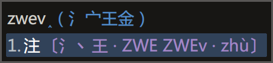

# 徐码三重注解补丁

[发布地址](https://github.com/Ace-Who/rime-xuma-spelling) ·
[项目主页](https://ace-who.github.io/rime-xuma-spelling/)

## 功能

字根拆分提示 + 编码提示 + 拼音提示
（快捷键 <kbd>Ctrl</kbd> + <kbd>Shift</kbd> + <kbd>R</kbd>）

## 说明

本补丁用于 rime 徐码输入方案。
需要 xuma.schema.yaml 文件，请自备。

1. 将 xuma.custom.yaml 放到 rime 用户目录（通常与 xuma.schema.yaml 并列），
2. 将 opencc 内的文件放到「程序目录/opencc」目录。

默认使用 `xuma_spelling_qmod.json`，可修改 xuma.custom.yaml 以改用
`xuma_spelling_qmod_xumaCase.json`，效果是大码大写。

## 提示

结合反查功能使用效果更佳，三重注解滤镜已经配置为对 `tag` 为 `reverse_lookup` 的
相关组件生效。

## 其它

字根拆分提示数据由 QQ 徐码输入法官方群（218210590）小鸮（1360057135）提供。  
拼音数据来自 [Mozillazg 整理的汉典数据](https://github.com/mozillazg/pinyin-data)。
