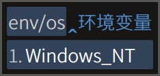

# Rime 徐码三重注解方案

[发布地址](https://github.com/Ace-Who/rime-xuma-spelling) ·
[项目主页](https://ace-who.github.io/rime-xuma-spelling/) ·
[徐码文档](https://www.xumax.top) ·
[Rime 输入法引擎 | 中州韻 | 小狼毫 | 鼠须管](https://rime.im/)

请仔细阅读本说明。安装和使用中 99% 的问题，答案都在这里。

三重注解的特点：

- 字根拆分 + 编码 + 拼音。
- 支持词组拆分（按照官方词组编码规则）。
- 大码大写、全简合一。

方案自带说明：

快捷键演示：

## 安装说明（已经很短的）

1. 将 schema 目录下的文件放到 rime 用户目录（易错题：什么是[用户目录](
  https://github.com/rime/home/wiki/UserData)）。
2. 在输入法设定中添加方案「徐码／爾雅·Q分享版」。

注：从 v0.5 起，不再使用 v0.4 中预编译的
`lua/ace/data/xuma_spelling.reverse.bin` 文件，可以直接删除之。

## 功能

重点总结：

- 三重注解、双重反查，尤其适合徐码简繁通打输入法的初学者（我）。
- 固定词序和自造词动态调序兼得，两全其美。
- 还可一键屏蔽词组，同时满足单字派和词组派。
- 全码单字后置：出简亦出全，只不过将全码单字放到后面。徐码已经很优秀，仅剩的个别
简全重码，用这个进一步剿灭。

特色功能分项简述（全部可以开关或控制）：

- 三重注解，详情见下。默认开启。
- 屏蔽词组。默认关闭。
- 多字符集选择：GB2312、GBK（默认）、BIG5、UTF-8。
- 显示时钟，默认关闭。
- 繁体简化，即繁入简出。默认关闭。
- 简入繁出。默认关闭。
- 全拼反查、五笔画反查、双重反查。
- 全码单字后置，即重码时将匹配到全码的单字降低排序，这样简码字词就会靠前。默认
开启。

固定特性：

- 固态词典固定词序：这个特性的意义，形码用户都明白。
- 支持手动造词：以分号「;」分隔输入串。
- 支持自动造词：连续上屏的字词，自动成词，最长 5 字。需再次输入词组编码并上屏才
会成为用户词，所以不影响已有用户词。
- 自造词自动调序：即自造词排在内置词（固态词典）之后，内置词顺序固定。

## 使用说明

自带说明请善加利用：

- ~<kbd>Ctrl</kbd> + <kbd>Shift</kbd> + <kbd>R</kbd>：三重注解~ (划掉)
- <kbd>Ctrl</kbd> + <kbd>Shift</kbd> + <kbd>F</kbd>：简入繁出
- <kbd>Ctrl</kbd> + <kbd>C</kbd>：三重注解，仅在选字界面有效。
- <kbd>Ctrl</kbd> + <kbd>S</kbd>：屏蔽词组，仅在选字界面有效。
- <kbd>Ctrl</kbd> + <kbd>T</kbd>：显示时钟，仅在选字界面有效。
- <kbd>F4</kbd> / <kbd>Ctrl</kbd> + <kbd>\` </kbd> 选单：可控制以上开关和字符集
选择、繁体简化（繁入简出）、全码单字后置。
- 引导符「\`」：双重反查（全拼 + 五笔画）。
- 引导符「\`P」：全拼反查。
- 引导符「\`B」：五笔画反查（横h 竖s 撇p 捺/点n 折z）。
- `env/`：获取系统环境变量，后跟变量名。
- `help/`：查看本方案简要使用说明。

更多细节演示：

## 关于码表

本方案采用徐码作者徐国银先生提供的码表，含九万多字和约八万词组。官方群的群友在
不断修订码表，本方案也将随之更新。

## 关于简码的修改

我在实际使用中发现原码表的简码设置有个别体验欠佳，便根据汉语语料字频统计资料作
了修改。徐码的简码设置原则之一，是简码不占用全码汉字的编码（更遑论多重简），我
认同并基本遵循这个原则。

举一个修改的例子：「没」「为」二字在不同的字频统计资料中数据互有高低，可视为同
级别高频字，但是原码表仅为「为」字设置了一级简码 `z`，而「没」字没有简码，其全
码 `zqs` 既长，又对 qwerty/colemak/workman/norman 键盘极不友好。自然的想法是为
「没」字设置二简 `zq`，可将输入难度降低三成，聊胜于无。问题是 `zq` 已被设置为「
学」字的简码，且「学」字同为高频字，值得这个简码。所以，唯一的解决办法就是将
`z` 让给「没」字，将「沙」的二简 `zc` 让给「为」。「沙」字也确实不太值得设二简
，将「娑」字的三简 `zcp` 让给它最为合适。权衡得失，这个改法的综合收益最大，故采
用之。

所有修改汇总在[`这里`](misc/xuma_shortcode_patch.txt) 。以下仅列出涉及一级简码
单字的修改：

- `h`：「在 `h hkjv`」「有 `hsv`」改为「在 `hk hkjv`」「有 `h hsv`」。
- `m`：「同 `m mgov`」「见 `mve`」改为「同 `mg mgov`」「见 `m mve`」。
- `n`：「国 `n neww`」「当 `nbu`」改为「国 `ne neww`」「当 `n nbu`」。
- `z`：「为 `z zcl`」「没 `zqs`」改为「为 `zc zcl`」「没 `z zqs`」。

随着本方案的更新，简码也可能发生新的修改，请知悉。

## 数据来源

字根拆分原始数据由 QQ 徐码输入法官方群（218210590）小鸮（1360057135）提供。  
拼音数据来自 [Mozillazg 整理的汉典数据](https://github.com/mozillazg/pinyin-data)。  

## 常见问题

为什么安装之后打不出汉字？
- 答：请仔细阅读安装说明。

为什么有些候选词显示为方块或空白？
- 答：你使用的字体没有收取这个字。

为什么手机同文输入法使用此方案没有三重注解，无法屏蔽词组、显示时钟、后置
全码单字？
- 答：同文输入法官方版目前不支持 lua 插件，这几个功能是通过 lua 插件实现的。

为什么叫做「徐码／爾雅·Q分享版」？
- 答：「爾雅（简繁通打）输入法」是徐码（简繁通打）输入法的别名。「Q」是我的别名
。「分享版」和我自己在用的方案主要功能相同，但为大众化计，需要去个性化，改个名
字，便于在我的设备上共存和测试。用户可自由修改此方案名，但除非懂得，不要修改
`schema_id` 和任何文件的名称或路径。
