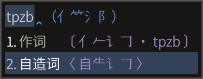

# Rime 徐码输入方案

[发布地址](https://github.com/Ace-Who/rime-xuma) ·
[项目主页](https://ace-who.github.io/rime-xuma/) ·
[徐码文档](https://www.xumax.top) ·
[Rime 输入法引擎 | 中州韻 | 小狼毫 | 鼠须管](https://rime.im/)

请仔细阅读本说明。安装和使用中 99% 的问题，答案都在这里。

这是一个初学者为了让自己用最舒服的姿势学会徐码和日常打字而设计的用于 Rime 平
台的方案。（徐码简繁通打输入法，又名爾雅简繁通打输入法。）

特色功能「三重注解」：

- 字根拆分 + 编码 + 拼音。
- 支持词组拆分（按照官方词组编码规则）。
- 大码大写、全简合一。
- 标点和[符号](
  https://github.com/rime/rime-prelude/blob/master/symbols.yaml
  )也显示徐码编码。（symbols.yaml 为 Rime 发行版自带，同文除外，但可复制。）

方案自带说明：

快捷键演示：

## 安装说明（已经很短的）

1. 将 schema 目录下的**所有**文件放到 rime 用户目录（易错题：什么是[用户目录](
  https://github.com/rime/home/wiki/UserData)）。
2. 在输入法设定中添加方案「徐码／爾雅·Q分享版」。

## 功能

重点总结：

- 三重注解、双重反查，为徐码初学者（我）扫除障碍。
- 固定词序和自造词动态调序兼得，两全其美。
- 还可一键屏蔽词组，同时满足单字派和词组派。
- 全码后置：出简亦出全，只不过将全码单字放到后面，消除个别简全重码的影响。

可即时开关或变更的功能：

- 【三重注解】：参考演示。默认开启。
- 【全拼反查】【五笔画反查】【双重反查】。
- 【屏蔽词组】：默认关闭。
- 【字集切换】：GB2312、GBK（默认）、BIG5、UTF-8。
- 【显示时钟】：默认关闭。
- 【繁体简化】：即繁入简出。默认关闭。
- 【简入繁出】：默认关闭。
- 【全码后置】：即重码时将匹配到全码且有简码的单字降低排序，这样简码字词就会靠
前。默认开启。

固定特性：

- 内置词顺序固定：固态词典中的字词，永远置顶且顺序固定。
- 自造词自动调序：用户词典中的词组，最近常用者排序靠前。
- 支持手动造词：只需以单引号「'」分隔输入串。如：欲造「手动造词」，输入
`rs'ea'poz'zb` 后依次选字即可。由于已有词组「手动」和「造词」，也可输入
`rsea'pozb`。
- 支持自动造词：连续上屏的字词，五字以内的段落，自动编码为四码。再次输入该编码
并上屏，即成为用户词（特征是后面不再出现太极图章「☯」，且输入前几码即显示逐键提
示）。参考下方图示。

上屏成词之后：

## 使用说明

自带说明请善加利用：

功能开关快捷键：

- <kbd>Ctrl</kbd> + <kbd>Shift</kbd> + <kbd>4</kbd>：繁体简化
- <kbd>Ctrl</kbd> + <kbd>Shift</kbd> + <kbd>F</kbd>：简入繁出
- <kbd>Ctrl</kbd> + <kbd>C</kbd>：三重注解，仅在选字界面有效。
- <kbd>Ctrl</kbd> + <kbd>S</kbd>：屏蔽词组，仅在选字界面有效。
- <kbd>Ctrl</kbd> + <kbd>T</kbd>：显示时钟，仅在选字界面有效。
- <kbd>F4</kbd> / <kbd>Ctrl</kbd> + <kbd>\` </kbd> 选单：可控制以上所有开关和字
符集选择、全码后置。

功能引导串：

- `` ` ``：双重反查（全拼 + 五笔画）。
- `` `P``：全拼反查。
- `` `B``：五笔画反查（横h 竖s 撇p 捺/点n 折z）。
- `env/`：获取系统环境变量，后跟变量名。
- `help/`：查看本方案简要使用说明。

技巧提示：

- 使用拼音反查时，默认排序以繁体优先，可通过切换「繁体简化」来改变，同时「简入
繁出」应当是关闭的。

更多细节演示：

## 数据来源

码表采用徐码作者徐国银先生提供的码表，含九万多字和约八万词组。官方群的群友在不
断修订码表，本方案也将不定期地随之更新。

字根拆分原始数据由 QQ 徐码输入法官方群（218210590）小鸮（1360057135）提供。  
拼音数据来自 [Mozillazg 整理的汉典数据](https://github.com/mozillazg/pinyin-data)。  

## 关于简码的调整

在实际使用中，我发现原码表的简码设置有个别体验欠佳，便根据汉语语料字频统计资料
作了修改。徐码的简码设置原则之一，是简码不占用全码汉字的编码（更遑论多重简），
我认同并基本遵循这个原则。

举一个修改的例子：「没」「为」二字在不同的字频统计资料中数据互有高低，可视为同
级别高频字，但是原码表仅为「为」字设置了一级简码 `z`，而「没」字没有简码，其全
码 `zqs` 既长，又对 qwerty/colemak/workman/norman 键盘极不友好。自然的想法是为
「没」字设置二简 `zq`，可将输入难度降低三成，聊胜于无。问题是 `zq` 已被设置为「
学」字的简码，且「学」字同为高频字，值得这个简码。所以，唯一的解决办法就是将
`z` 让给「没」字，将「沙」的二简 `zc` 让给「为」。「沙」字也确实不太值得设二简
，将「娑」字的三简 `zcp` 让给它最为合适。权衡得失，这个改法的综合收益最大，故采
用之。

所有修改汇总在[→这里←](misc/xuma_shortcode_patch.txt) 。以下仅列出涉及一级简码
单字的修改：

| 一级简码 | 原字原编码 | 现字原编码 | 原字现编码 | 现字现编码 |
| -------- | ---------- | ---------- | ---------- | ---------- |
| `a` | 出 `a aau`  | 能 `asv` | 出 `aa aau`  | 能 `a asv` |
| `h` | 在 `h hkjv` | 有 `hsv` | 在 `hk hkjv` | 有 `h hsv` |
| `m` | 同 `m mgov` | 见 `mve` | 同 `mg mgov` | 见 `m mve` |
| `n` | 国 `n neww` | 当 `nbu` | 国 `ne neww` | 当 `n nbu` |
| `z` | 为 `z zcl`  | 没 `zqs` | 为 `zc zcl`  | 没 `z zqs` |

随着本方案的更新，简码也可能发生新的修改，请知悉。

## 常见问题

为什么安装之后打不出汉字？
> 答：请仔细阅读安装说明。

为什么有些候选词显示为方块或空白？
> 答：你使用的字体没有收取这个字。

为什么手机同文输入法使用此方案没有三重注解，无法屏蔽词组、显示时钟、后置
全码单字？
> 答：同文输入法官方版目前不支持 lua 插件，这几个功能是通过 lua 插件实现的。

为什么 Linux 发行版使用此方案没有三重注解，无法屏蔽词组、显示时钟、后置 全码单
字？
> 答：同样是对 lua 的支持问题，参考 librime-lua 作者的[解释](
  https://github.com/hchunhui/librime-lua/issues/22)。

为什么码表更新后，有的字用新的编码打不出来？
> 答：需要「重新部署」。

为什么码表更新后，有的字还能用旧的编码打出来？
> 答：需要「重新部署」。如果以前用旧编码打过这个字，那么它还被记录在用户词典中
。删除方法是输入旧编码，选中该字，敲删词快捷键 <kbd>Ctrl</kbd> + <kbd>K</kbd>
或 <kbd>Ctrl</kbd> + <kbd>Delete</kbd> 或 <kbd>Shift</kbd> + <kbd>Delete</kbd>
，不需要重新部署。若要删除整个用户词典，可删除 `用户目录/xuma.userdb` 目录，并
重新部署（？）。

为什么叫做「徐码／爾雅·Q分享版」？
> 答：「爾雅（简繁通打）输入法」是徐码（简繁通打）输入法的别名。「Q」是我的别名
。「分享版」和我自己在用的方案主要功能相同，但为大众化计，需要去个性化，改个名
字，便于在我的设备上共存和测试。用户可自由修改此方案名，但除非懂得，不要修改
`schema_id` 和任何文件的名称或路径。

`lua/ace/data/xuma_spelling.reverse.bin` 文件是什么？
> 答：这是 v0.4 中预编译的三重注解词典，从 v0.5 起不再使用，可以删除。

