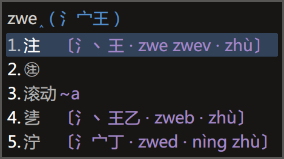

# 徐码三重注解补丁

发布地址：[https://github.com/Ace-Who/rime-xuma-spelling]()



## 功能

字根拆分提示 + 编码提示 + 拼音提示
（用快捷键 <kbd>Ctrl</kbd> + <kbd>Shift</kbd> + <kbd>R</kbd> 开关）

## 说明

本补丁用于 rime 徐码输入方案。
需要 xuma.schema.yaml 文件，请自备。

将 xuma.custom.yaml 放到 rime 用户目录（通常与 xuma.schema.yaml 并列），
将 opencc 内的文件放到「程序目录/opencc」目录。

字根拆分提示数据由 QQ 徐码输入法官方群（218210590）小鸮（1360057135）提供。
Ace Who 加入编码和拼音提示。
拼音数据取自 Rime 地球拼音（terra），有些不完整，如：

```
数据 〔米女攵 · xc xcpm · shù〕〔扌尸古 · fdj fdjg · jū〕
```
