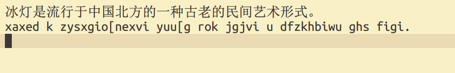
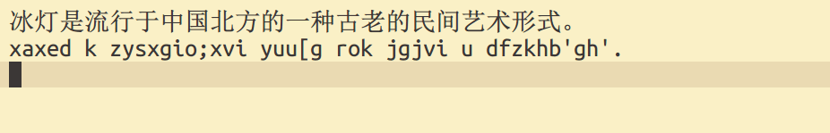

# 徐码五二顶

## 什么是五二顶

四码限长方案的用户应该都熟悉「五码顶屏」的打法，即每次打第五码时就顶出前四码，
上屏其第一候选，此时输入缓冲区只剩下最后一码，从而实现省略四码字后面的空格的目
的。然而五笔、郑码这样的方案，对于单字派，四码字的频率是很低的，节省的空格对整
体效率的贡献很小，粗略测算为 3%。而徐码的四码字频率还要低一些，因此贡献更小。那
么几码字的频率最高呢？对于徐码，答案是二码字。徐码的二码字几乎占到一半，高于其
他任何码长的总字频，所以，从效率的角度讲，最佳选择是节省二码字的空格。我们需要
一个方案来实现这个目的，「五二顶」为此而生。它与常规方案的区别仅仅是每逢五码顶
出的是前二码，剩下的是后三码。五二顶与常规方案的码表一致，保持了徐码「完美的规
则性」。

## 五二顶的优势

省略了多少空格？键长降低了多少？

用科学形码评测系统v1.6.3 测试，前 `300/1500/6000` 字的加权键长依次为
`2.14/2.53/2.61`。（需要把「的」字改为一键顶屏字，否则结果是 `2.20/2.57/2.65`。
实际使用不是通过码表定义，而是在方案中通过配置标点实现，由于标准键盘已无空余的
理想键位可用，本方案暂未提供该配置。）低于三码限长的至至郑码，高于四二顶方案
C42。

与四码限长方案比较，可可五笔86 的成绩是 `2.95/3.19/3.23` ，张码是
`2.91/3.14/3.18`，郑码是 `2.90/3.16/3.20`，徐码是 `2.91/3.15/3.19`（我个人优化
过简码的徐码是 `2.81/3.07/3.12`），顺便可以看到，诸四码限长方案的差距仅在 2% 以
内。相比于我的个人徐码码表，五二顶的加权键长（按不配置一键顶屏字「的」计）缩短
了 `22%/18%/16%`，即后者键长为前者的 `78%/82%/84%` ，在同样击键速度的条件下，打
字速度比值是其倒数，即 `128%/119%/118%`。若与官方码表相比，则这组数字是
`132%/123%/120%`。不过考虑到指法，空格键优于全体按键的平均水平，节省大量空格之
后剩余按键的指法平均水平略低于原有水平。因此实际击键速度会低于常规方案，从而打
字速度会略低于理论值。

经赛码器测试，用五二顶和常规方案打文章，都打单字时键长降低 15%~18%，都打简词时
键长降低 12%~15%，符合前述评测系统的结果。我个人不打任何全码词组，五二顶的最佳
实践也是不打全码词组，所以大词库的测试就不做了。

简言之，键长令人满意。五二顶改造当然无法和天生的顶功方案相提并论，但是别忘了徐
码是以全体九万汉字为编码目标的，无论是加权还是未加权的重码率都是最低之一，本方
案没有牺牲这一优势。

## 区重补码

输入三码（或四码）后，若要选重，存在一个歧义，是要对整段输入码选重，还是要对后
一码（或两码）选重？本方案用数字键作为整体选重键，另引入区重补码来对后一段输入
码选重。技术上，区重补码不是选重键，而是编码的一部分。

徐码五二顶沿用常规版码表，一级简码和二级简码设置了三重候选，第一重为单字，二三
重为词组。为一简和二简增设区重补码 `[;'`，打出补码后自动上屏。如 `u` 的三重候选
为 「的」「的是」「的时候」，它们同时还有另一组编码，即 `u[`、`u;`、`u'` 输入这
组编码即可自动上屏这三个词条。为方便和效率计，补码 `[` 还绑定到了 `TAB` 键，这
样安排在双手对称位置，尽可能接近敲空格的体验。

在三码或四码后输入补码时，会上屏前二码的第一候选和余下编码对应的简码词条。参
考下面的示例。

## 五二顶示例详解

例子（`_` 表示空格）：

    fstgl_ = 示例 = fs_tgl_

在输入 `l` 时输入码长度达到 5，会顶出前二码 `fs` 并上屏其第一候选「示」，余下三
码 `tgl` 的唯一候选是「例」，按空格后上屏。

    fuvr_ = 摠
    fuvr2 = 输入
    fuvr[ = 输入（等同于 fu_vr_）

空格上屏等同于按数字键 1，是上屏候选界面的第一项。同样是上屏「输入」，`fuvr2`
是选择 `fuvr` 的第二候选，是词组打法。 `fuvr[` 是依次上屏「输」「入」二字，是单
字打法。`fu = 输, vr[ = 入`，在输入 `[` 时顶出前二码 `fu`，自动上屏「输」和「入
」。五二顶是可以完全打单字或简词的，具有完全的确定性，因为它和常规的五码顶屏没
有本质区别。又如：

    xk[ = xk_ = 单
    wb[ = wb_ = 字
    xkwb[ = 单字 = xk_wb_（打单字）
    xkwb_ = 单字（打词组）

    sb[ = sb_ = 很
    ea; = ea2 = 可能
    sbea; = 很可能 = sb_ea2
    sbea_ = 律动

    cbu[ = 好的 = cb_u_
    gqwg_ = 确定 = gq_wg_
    yuwci_ = 方案 = yu_wci_
    fuvrzj[ = 输入法 = fu_vr_zj_

只能顶前二码，不是二码字就只能用空格上屏，正如五四顶中只能顶前四码。错误顶码的
例子：

    正：f_cx_ = 大小
    误：fcx[ = 车道 = fc_x_

    正：pvz_rk_ = 选重
    误：pvzrk[ = 先话是 = pv_zr_k_

    正：sui_gam_ = 徐码
    误：suigam[ = 脸工马 = su_ig_am_（三码字并无区重补码，gam[ 也不对）

只能顶首选，其他候选只能先选重上屏，再输入后续文字的编码。错误顶码的例子：

    正：kj;kg_ = 思考题
    误：kjkg[ = 甲题 = kj_kg_

## 键长比较和演示

下面依次用常规方案的单字打法、简词打法和五二顶方案的单字打法、简词打法来打同一
段文字。常规方案打法也省略标点前的空格。界面候选的选重键假定为数字键（常规方案
固然可以定义符号键选重，但由于顶功占用了符号来作区重补码，就统一为数字键选重，
以免混淆和误解。）试比较它们的键长。

``` 
简词标注：
冰灯是流行于[中国]北方的一种古老的民间[艺术][形式]。[因为][独特]的地域优势，黑龙江[可以]说是[制作]冰灯最早的[地方]。

原始文本：
冰灯是流行于中国北方的一种古老的民间艺术形式。因为独特的地域优势，黑龙江可以说是制作冰灯最早的地方。
xa xed k zy sx gi o ne xvi yu u g rok jg jvi u df zk hb iwu ghs figi.nf zc vlv pji u j jfo tjo fr,mh jpu zi eo c zx k pm tpl xa xed kh kz u j yu.
xa xed k zy sx gi o;xvi yu u g rok jg jvi u df zk hb3gh3.n2vl3u j jfo tjo fr,mh jpu zi e2zx k pt2xa xed kh kz u j3.
xaxed k zysxgio[nexvi yuu[g rok jgjvi u dfzkhbiwu ghs figi.nfzcvlv pji u j jfo tjo fr,mhjpu zieoc[zxk[pmtpl xaxed khkzu[j yu.
xaxed k zysxgio;xvi yuu[g rok jgjvi u dfzkhb'gh'.n;vl'u j jfo tjo fr,mhjpu zie;zxk[pt;xaxed khkzu[j'.

按照引入置换码后的码表：
xa xed k zy sx gi o ne xvi yu u g ro jg jv u df zk hb iwu ghs fi.nf zc vlv pji u j jfo tjo fr,mh jpu zi eo c zx k pm tp xa xed kh kz u j yu.
xa xed k zy xs gi o;xvi yu u g ro jg jv u df zk hb3gh3.n2vl3u j jfo tjo fr,mh jpu zi e2zx k pt2xa xed kh kz u j3.
xaxed k zysxgio[nexvi yuu[g rojgjvu[dfzkhbiwu ghs fi.nfzcvlv pji u j jfo tjo fr,mhjpu zieoc[zxk[pmtpxaxed khkzu[j yu.
xaxed k zysxgio;xvi yuu[g rojgjvu[dfzkhb'gh'.n;vl'u j jfo tjo fr,mhjpu zie;zxk[pt;xaxed khkzu[j'.
```

以下是单字打法和简词打法的慢速动态演示（使用的是较旧的码表，码长较长）：




一二简的第一候选总是可以用 `[` 上屏的，而空格上屏只能用在单独打的时候（即不是紧
接在二码字后）。如果每次先判断前一个字是不是单独打的、是不是一码或二码字，可能
降低效率，不容易形成条件反射，所以可以考虑在初期一律用 `[` 上屏一二码的第一候选
，即如下打法：

```
冰灯是流行于中国北方的一种古老的民间艺术形式。因为独特的地域优势，黑龙江可以说是制作冰灯最早的地方。
xaxed k[zysxgio[nexvi yuu[g[rok jgjvi u[dfzkhbiwu ghs figi.nfzcvlv pji u[j[jfo tjo fr,mhjpu zieoc[zxk[pmtpl xaxed khkzu[j[yu.
xaxed k[zysxgio;xvi yuu[g[rok jgjvi u[dfzkhb'gh'.n;vl'u[j[jfo tjo fr,mhjpu zie;zxk[pt;xaxed khkzu[j'.

按照引入置换码后的码表：
xaxed k[zysxgio[nexvi yuu[g[rojgjvu[dfzkhbiwu ghs fi.nfzcvlv pji u[j[jfo tjo fr,mhjpu zieoc[zxk[pmtpxaxed khkzu[j[yu.
xaxed k[zysxgio;xvi yuu[g[rojgjvu[dfzkhb'gh'.n;vl'u[j[jfo tjo fr,mhjpu zie;zxk[pt;xaxed khkzu[j'.
```

## 与常规版功能的差异

### 造词和连打

切分符只能是反撇号 `` ` ``，并且插入切分符后才能进入「连打·造词」模式，造词是
在此模式中，自造词也只能在该模式中看到，这是由于 Rime 实现方式的限制。如造「五
二顶」，需输入 ``gd`ee`egm`` 并上屏，该词组即编码为 `geeg`，要调出时，需输入 ``
geeg` ``。

## 五二顶的最佳实践

五二顶的最佳实践是只打单字或打单字和简词，原则上避免打全码词组，这样思维负担较
小，且码长已经能与大多数四码限长方案与大词库的组合相匹敌。另外简码词库小且固定
（仅 1400 左右，其中少数低频词可不打），省去大量维护精力。

## 鸣谢

用 Rime 改造徐码为五二顶的方法来自蓝落萧的形音四二顶方案
[C42](https://github.com/lanluoxiao/c42)。
