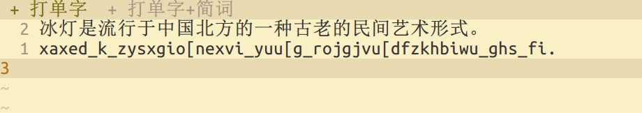
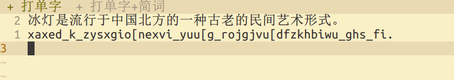
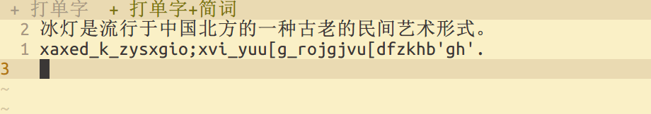
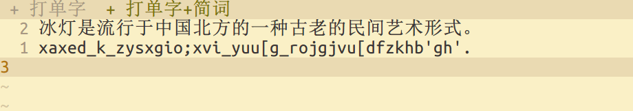

# 徐码五二顶说明书

## 什么是五二顶

四码限长方案的用户应该都熟悉「五码顶屏」的打法，即输入缓冲区每积至五码就顶出前
四码，上屏其第一候选，留下最后一码，目的是省略四码字后面的空格。然而，对于单字
派，四码字的频率很低，五笔和郑码约为 3%，徐码更低一些，所以节省的空格对效率的提
升作用很小。在徐码中，二码字的频率才是最高的，文章一般超过 40%。所以，最当节省
的是二码字的空格。为达此目的，需将原常规方案改造为「五二顶」。改造对象仅仅是编
码顶屏的逻辑，完全不触及编码规则，因此原封不动地保持徐码的字集和编码。它的核心
变化，仅仅是五码顶屏时顶出的是前二码，留下的是后三码。

## 适合人群

如前所述，五二顶的效率源自二码字的高比例，它适合单字派和小词库派，不适合词组派：

- 词组打得越多，二码字比例就越低，就越抑制五二顶优势的发挥。
- 当词组为第一候选时，若非后接标点，则仍须用空格上屏，所以键长比常规方案增加了 1。
- 当词组为第二或第三候选时，不能用 `;` 和 `'` 选重，因为它们被用作上屏码（后详），专用于一码和二码的二三选；所以指法更差。

## 效率分析

经「科学形码评测系统v1.6.3」测试，前 `300/1500/6000` 字的加权键长依次为
`2.14/2.53/2.61`。（需要把「的」字改为一键顶屏字，否则结果是 `2.20/2.57/2.65`。
实际使用不是通过码表定义，而是在方案中通过配置标点实现，由于标准键盘已无空余的
理想键位可用，本方案暂不便提供通用配置。）

| 编码方案 | 前 300 加权 | 前 1500 加权 | 前 6000 加权 |
| ---------- | ------ | ------ | ------ |
| 可可五笔86 | `2.95` | `3.19` | `3.23` |
| 郑码       | `2.90` | `3.16` | `3.20` |
| 张码       | `2.91` | `3.14` | `3.18` |
| 徐码       | `2.91` | `3.15` | `3.19` |
| 徐码QS     | `2.81` | `3.07` | `3.12` |
| 徐码五二¹ | `2.20` | `2.57` | `2.65` |
| 徐码五二² | `2.14` | `2.53` | `2.61` |

可以看到，诸四码限长方案的差距仅在 `2%` 以内。相比于我的个人徐码码表，五二顶的加
权键长（按不配置一键顶屏字「的」计）缩短了 `22%/16%/15%`，即后者键长为前者的
`78%/84%/85%` ，在同样击键速度的条件下，打字速度比值是其倒数，即
`128%/119%/118%`。若与官方码表相比，则这组数字是 `132%/123%/120%`。不过考虑到指
法，空格键优于全体按键的平均水平，节省大量空格之后剩余按键的指法平均水平略低于
原有水平。因此实际击键速度会低于常规方案，从而打字速度会可能略低于理论值。

经赛码器测试，用五二顶和常规方案打文章，都打单字时键长降低 15%~18%，都打简词时
键长降低 12%~15%，符合前述评测系统的结果。我个人不打任何全码词组，五二顶的最佳
实践也是不打全码词组，所以大词库的测试就不做了。

简言之，键长令人满意。五二顶改造当然无法和原生的顶功方案相提并论，但是别忘了徐
码是以全体九万汉字为编码目标的，无论是加权还是未加权的重码率都是最低之一，本方
案没有牺牲这一优势。

## 打字方法

编码没有任何变化，所以关于打字方法唯一可讲的，是上屏方法。简言之，就是五码顶二
码。但是存在不足五码的情况，即二码首选后跟一码或二码且无后续文字的情况，所以需
要引入上屏码。

称一个编码的候选——包括单字、词组、符号——为**词**。

称用空格或数字键上屏及用标点顶屏，为**一类上屏法**。这是常规方案的上屏方法。

- 所有三码词、四码词，只能使用一类上屏法。
- 所有一码词、二码词，既能使用一类上屏法，也能用上屏码上屏。
- 二码首选，若未达句末或标点，可以省略空格，继续输入后续文字，每逢五码或上屏码会顶头二码的首选上屏。
- 二码首选，若省略空格，后接一码词，则两词三码，不足五码，故须输入后词的上屏码，同时会顶前词上屏。
- 二码首选，若省略空格，后接二码词，且已达句末或标点，则两词四码，不足五码，故须输入后词的上屏码，同时会顶前词上屏。

总之，仅三码词、四码词需加空格或用标点顶屏；一码词都是二键（加上屏码）；二码首
选一律省略空格，除遇句末或标点需加上屏码外，也是二键。

### 上屏码（旧称「区重补码」）

**上屏码**为一码词和二码词专用，用于解决不足五码时如何顶前二码上屏的问题。有
`[ ; '` 三个上屏码，对应三重候选。例如 `u` 的三重候选依次为 「的／的是／的时候
」，除了共享一个编码 `u`，它们还各自具有唯一编码，依次为 `u[  u;  u'`。输入这组
编码将会直接上屏对应候选，如果有前置二码，也将顶其上屏。如 `ywwb[`，将同时顶「
文」（前置二码 `yw`）上屏，并上屏「字」（ `wb[`），即「文字」。又如 `zxu;` 将同
时顶「说」（前置二码 `zx`）上屏，并上屏「的是」（`u;`），即「说的是」。为指法计
，首选上屏码 `[` 还绑定到了 `TAB` 键，这样安排在双手对称位置，可避免同手连击和
小指大移位的同时发生。

## 打字示例详解

例子（`_` 表示空格）：

    示例 = fstgl_（省略 fs 二码首选「示」的空格）
    　　 = fs_tgl_

在输入 `l` 时，输入码长度达到 5，会顶出前二码 `fs` 并上屏其第一候选「示」，余下
三码 `tgl` 的唯一候选是「例」，可按空格上屏。

    艶 = mhqd_
    　 = mhqd1
    黑色 = mhqd2（打词组）
    黑色 = mhqd[（打单字）
    　　 = mh_qd_

空格键是上屏候选列表中的当前项，默认为第一项，等同于按数字键 1。同样是上屏「黑
色」，`mhqd2` 是选择 `mhqd` 的第二候选，是打词组；`mhqd[` 是同时但分别上屏「黑
」（`mh`）「色」（`qd[`）二字，是打单字。五二顶是可以完全打单字或简词的，具有完
全的确定性，因为它只是将常规的第五码顶四码改为第五码顶二码，并引入上屏码实现不
足五码顶二码，没有本质区别。又如：

    单 = xk[
    　 = xk_（一类上屏法）
    字 = wb[
    　 = wb_（一类上屏法）
    单字 = xkwb[（打单字）
    　　 = xk_wb_
    单字 = xkwb_（打词组）
    　　 = xkwb1

    很 = sb[
    　 = sb_（一类上屏法）
    可能 = ea;
    　　 = ea2（一类上屏法）
    很可能 = sbea;（「很」+「可能」）
    　　　 = sb_ea2
    　　　 != sbea2（词组「很可能」的正确编码为 seas）

    好的 = cbu[
    　　 = cb_u_
    　　 != cbu_ = 妇
    名字 = qowb[
    　　 = qo_wb_
    　　 != qowb_ = 酁（未过滤字集时，qowb2 才是「名字」）
    方案 = yuwci_
    　　 = yu_wci_
    说明书 = zxksbb[
    　　　 = zx_ks_bb_

再次提醒，顶的是前二码，不是二码词就不能用编码顶屏，只能用一类上屏法。正如五四
顶中顶的是前四码，不是四码词就必须用空格或选重键上屏或用标点顶屏。这类错误顶屏
的例子：

    大小 = f_cx_（「大」是一码词）
    　　 = f[cx[
    　　 != fcx[
    　　 = fc_x_ = 车道
    选重 = pvz_rk_（「选」是三码词）
    　　 != pvzrk_
    　　 = pv_zrk_ = 先湩
    徐码 = sui_gam_（「徐」是三码词）
    　　 != suigam_
    　　 = su_igam_ = 脸（igam 空码）

再次提醒，顶的是首选，非首选只能先上屏，再输入后续文字。这类错误顶屏的例子：

    一些人 = gl;uu_
    　　　 = gl;uu[
    　　　 != gluu[
    　　　 = gl_uu_ = 正人
    gl 的首选是「正」，次选才是「一些」，所以「一些」不能通过后续编码来顶上屏。

## 键长比较和演示

下面为同一段文字的四种打法的编码——常规方案打单字、常规方案打简词、五二顶打单
字、五二顶打简词；都采用标点顶屏。选重键假定为数字键（常规方案固然可以设置符号
键选重，但由于顶功占用了符号来做上屏码，就统一为数字键选重，以免混淆和误解。）
试比较它们的键长。

```
原始文本（下方划出简词）：
冰灯是流行于中国北方的一种古老的民间艺术形式。因为独特的地域优势，黑龙江可以说是制作冰灯最早的地方。
　　　　　　﹀﹀　　　　　　　　　　﹀﹀︾︾　﹀﹀︾︾　　　　　　　　　﹀﹀　　﹀﹀　　　　　﹀﹀　
xa_xed_k_zy_sx_gi_o_ne_xvi_yu_u_g_ro_jg_jv_u_df_zk_hb_iwu_ghs_fi.nf_zc_vlv_pji_u_j_jfo_tjo_fr,mh_jpu_zi_eo_c_zx_k_pm_tp_xa_xed_kh_kz_u_j_yu.
xa_xed_k_zy_xs_gi_o;xvi_yu_u_g_ro_jg_jv_u_df_zk_hb3gh3.n2vl3u_j_jfo_tjo_fr,mh_jpu_zi_e2zx_k_pt2xa_xed_kh_kz_u_j3.
xaxed_k_zysxgio[nexvi_yuu[g_rojgjvu[dfzkhbiwu_ghs_fi.nfzcvlv_pji_u_j_jfo_tjo_fr,mhjpu_zieoc[zxk[pmtpxaxed_khkzu[j_yu.
xaxed_k_zysxgio;xvi_yuu[g_rojgjvu[dfzkhb'gh'.n;vl'u_j_jfo_tjo_fr,mhjpu_zie;zxk[pt;xaxed_khkzu[j'.
```

以下是单字打法和简词打法的慢速动态演示，包含「预显候选」开启和关闭两种情况：







以下是单字打法和简词打法的正常速度动态演示：


一码、二码的首选总是可以用 `[` 上屏的，而空格上屏只能用在单独打的时候（即不存在
未上屏的前置二码），所以可以考虑在初期一律用 `[` 上屏，以简化思维，即如下打法：

```
冰灯是流行于中国北方的一种古老的民间艺术形式。因为独特的地域优势，黑龙江可以说是制作冰灯最早的地方。
xaxed_k[zysxgio[nexvi_yuu[g[rojgjvu[dfzkhbiwu_ghs_fi.nfzcvlv_pji_u[j[jfo_tjo_fr,mhjpu_zieoc[zxk[pmtpxaxed_khkzu[j[yu.
xaxed_k[zysxgio;xvi_yuu[g[rojgjvu[dfzkhb'gh'.n;vl'u[j[jfo_tjo_fr,mhjpu_zie;zxk[pt;xaxed_khkzu[j'.
```

## 与常规版的功能差异

### 造词和连打

切分符只能是反撇号 `` ` ``，并且插入切分符后才能进入「连打·造词」模式，造词是
在此模式中，自造词也只能在该模式中看到，这是由于 Rime 实现方式的限制。如造「五
二顶」，需输入 ``gd`ee`egm`` 并上屏，该词组即编码为 `geeg`，要调出时，需输入 ``
geeg` ``。

## 五二顶的最佳实践

五二顶的最佳实践是只打单字或打单字和简词，原则上避免打全码词组，这样思维负担较
小，且码长已经能与大多数四码限长方案与大词库的组合相匹敌。另外简码词库小且固定
（仅 1400 左右，其中少数中低频词不必强行记忆和使用），省去大量维护精力。

## 鸣谢

用 Rime 改造徐码为五二顶的方法来自蓝落萧的形音四二顶方案
[C42](https://github.com/lanluoxiao/c42)。
